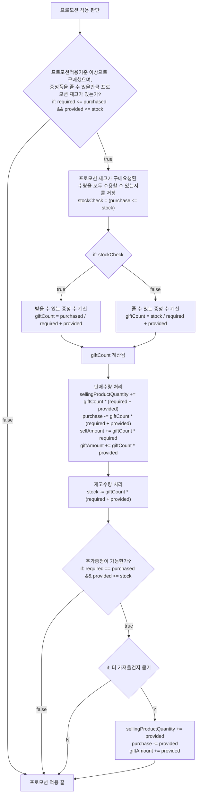

# java-convenience-store-precourse

편의점 어플리케이션의 패키지 구조, 구현 기능 목록, 주의사항, 애매한 동작에 대한 커스텀규칙을 정리한 문서.

## 1. 패키지 구조

```
lotto
  Application   // 프로그램 전반의 실행과 종료의 책임을 가진 클래스
  - common          // 앱의 관심사 외부라고 판단되는 기능
    - data              // 외부 데이터 액세스 기능의 집합
    - util              // 그 중 앱의 어떤 계층/객체에서나 활용할 수 있는 기능의 집합
    - value             // 매우 통상적이어서 어떤 로직에서나 활용할만한 값의 집합
    - view              // 그 중 앱의 view 계층/객체에서 활용될 만한 기능의 집합
  - storeapp        // 앱이 수행하고자 하는 핵심 관심사 기능
    - view              // 그 중 앱과 관련된 사용자 인터페이스 입출력 기능 객체의 집합
    - controller        // 그 중 핵심 관심사의 실행과 제어 책임을 가진 객체의 집합
    - model             // 그 중 핵심 관심사를 단일 책임으로 분리하여 담당하는 작은 객체들의 집합
    - value               // 그 중 값으로 식별되는 값객체들의 집합
```

- **단일한 책임의 작은 객체**로 프로그램을 구성하려 시도
- 그러다 보니 자연스럽게 깊은 depth의 패키지부터 작성
- 따라서 쉬운 기능 파악을 위해서는 하위 패키지의 클래스부터 읽는 것을 권장 (위 목록의 아래부터 위로)

## 2. 구현 기능 목록

### 2.1. 전체 요구사항

- [x] 사용자가 입력한 `상품`의 `가격`과 `수량`을 기반으로 최종 결제 `금액`을 계산한다.
    - [x] `총구매액`은 `상품`별 `가격`과 `수량`을 곱하여 계산하며, `프로모션` 및 `멤버십 할인`을 반영하여 최종 결제 금액을 산출한다.
        - [x] `상품`은 `상품명`, `가격`, `정가상품수량`, `프로모션상품수량`, `프로모션`으로 이루어진다.
            - [x] `이름`은 비교할 수 있다.
            - `상품명`은 `이름`의 확장이다.
            - [x] `상품명`은 15자의 길이 제한이 있다.
            - `프로모션명`은 `이름`의 확장이다.
            - [x] `프로모션명`은 10자의 길이 제한이 있다.
            - [x] `수량`은 0 또는 양의 정수다.
            - [x] `수량`은 비교 가능하다.
            - [x] `수량`은 동등비교 가능하다.
            - [x] `수량`은 더하기 연산이 가능하다.
            - `가격`과 금액(==`원화`)은 다른 개념이다. `가격`은 `#할인`이라는 행위를 통해 음수를 허용한다.
            - [x] `가격`은 0 또는 정수다.
            - [x] `가격`은 더하기/곱하기/빼기 연산이 가능하다.
            - [x] `원화`는 돈의 단위이며, 0 또는 양의정수다.
            - [x] `원화`는 덧셈/나머지연산이 가능하다.
            - [x] `원화`는 표기 시 천단위 콤마 표기된다.
            - [x] `일자`는 날짜 형식의 문자열로 생성가능하다.
            - [x] `일자`는 전후(대소)비교가 가능하다.
            - [x] `기간`은 `(시작)일자`와 `(종료)일자`를 가지고 생성된다. 종료일이 시작일보다 앞설 수 없다.
            - [x] `기간`은 범위포함판단이 가능하다.
            - [x] `프로모션수량`은 `(프로모션적용) 수량`과 `(프로모션증정) 수량`으로 생성된다.
            - [x] `프로모션수량`의 수량들은 양의 정수다.
            - [x] `프로모션`은 `프로모션명`, `프로모션수량(구매/증정)`, `(행사시작/종료)기간`으로 이루어진다.
            - [x] `상품수량`은 상품의 판매 가능한 재고로써 0 또는 양의정수다.
            - [x] `상품수량`은 결제요청된 상품 개수로 인해 차감될 수 있다. 0 이하로 차감될 수는 없다.
        - [x] `상품`은 현재구매건의 구매수량이 남은 재고수량을 초과하면 예외를 발생한다.
        - [x] `상품`은 `프로모션` 적용 여부를 계산한다.
            - [x] `프로모션` 적용 여부는 다음 조건들을 가진다.
                - [x] `프로모션 기간` 내에
                - [x] `프로모션 필요구매수량` 이상 구매 시
                - [x] `프로모션 상품 수량` >= `프로모션 필요구매수량` + `프로모션 증정수량`이면.
        - [x] `상품`은 적용 여부를 알릴 수 있어야 한다.
        - [x] `상품`은 적용 수량을 알릴 수 있어야 한다.
        - [x] `상품`은 재고가 부족해서 증정분을 못 받게 되는지 알릴 수 있어야 한다.
            - 정가 결제(`상품명`, `수량`)를 알려야 하기 때문.
        - [x] `상품`은 `멤버십 할인` 적용 여부를 계산한다.
        - [x] `상품`은 `총구매액`을 계산한다.
- [x] 구매내역과 산출한 금액 정보를 `영수증`으로 출력한다.
- [x] `영수증` 출력 후 추가 구매를 진행할지 또는 종료할지를 선택할 수 있다.
- [x] 요구사항에 맞게 입력받는다.
- [x] 요구사항에 맞게 출력한다.

### 2.2. 재고 관리 요구사항

- [x] 각 상품의 재고 수량을 고려하여 결제 가능 여부를 확인한다.
- [x] 고객이 상품을 구매할 때마다, 결제된 수량만큼 해당 상품의 재고에서 차감하여 수량을 관리한다.
- [xx 재고를 차감함으로써 시스템은 최신 재고 상태를 유지하며, 다음 고객이 구매할 때 정확한 재고 정보를 제공한다.

### 2.3. 프로모션 할인 요구사항

- [x] 오늘 날짜가 프로모션 기간 내에 포함된 경우에만 할인을 적용한다.
- [x] 프로모션은 N개 구매 시 1개 무료 증정(Buy N Get 1 Free)의 형태로 진행된다.
- [x] 1+1 또는 2+1 프로모션이 각각 지정된 상품에 적용되며, 동일 상품에 여러 프로모션이 적용되지 않는다.
- [x] 프로모션 혜택은 프로모션 재고 내에서만 적용할 수 있다.
- [x] 프로모션 기간 중이라면 프로모션 재고를 우선적으로 차감하며, 프로모션 재고가 부족할 경우에는 일반 재고를 사용한다.
- [x] 프로모션 적용이 가능한 상품에 대해 고객이 해당 수량보다 적게 가져온 경우, 필요한 수량을 추가로 가져오면 혜택을 받을 수 있음을 안내한다.
- [x] 프로모션 재고가 부족하여 일부 수량을 프로모션 혜택 없이 결제해야 하는 경우, 일부 수량에 대해 정가로 결제하게 됨을 안내한다.

### 2.4. 멤버십 할인 요구사항

- [x] 멤버십 회원은 프로모션 미적용 금액의 30%를 할인받는다.
- [x] 프로모션 적용 후 남은 금액에 대해 멤버십 할인을 적용한다.
- [x] 멤버십 할인의 최대 한도는 8,000원이다.

### 2.5. 영수증 출력 요구사항

- [x] 영수증은 고객의 구매 내역과 할인을 요약하여 출력한다.
- 영수증 항목은 아래와 같다.
    - [x] 구매 상품 내역: 구매한 상품명, 수량, 가격
    - [x] 증정 상품 내역: 프로모션에 따라 무료로 제공된 증정 상품의 목록
    - [x] 금액 정보
        - [x] 총구매액: 구매한 상품의 총 수량과 총 금액
        - [x] 행사할인: 프로모션에 의해 할인된 금액
        - [x] 멤버십할인: 멤버십에 의해 추가로 할인된 금액
        - [x] 내실돈: 최종 결제 금액
- [x] 영수증의 구성 요소를 보기 좋게 정렬하여 고객이 쉽게 금액과 수량을 확인할 수 있게 한다.

### 2.5. 입출력 요구사항

- [x] 구현에 필요한 상품 목록과 행사 목록을 파일 입출력을 통해 불러온다.
    - `src/main/resources/products.md`과 `src/main/resources/promotions.md` 파일을 이용한다.
    - 두 파일 모두 내용의 형식을 유지한다면 값은 수정할 수 있다.

## 3. 주의사항

잊기 쉬운 제한사항과 얼핏 헷갈리지만 문서에 명확한 근거가 있어 해결되는 점을 기록한다.

```markdown
- (주의할 내용)
    - (근거가 되는 문구)
```

- 혼동이 오기 쉬운 프로모션 진행을 순서도로 정리한다.
    - (참고)프로모션 진행의 대전제: 프로모션이 적용되든 안되든 프로모션 재고부터 소진한다.
    - (참고) 아래 순서도를 참고하지 마세요. 잘못된 내용이지만 코드리뷰에 공유하고자 남겨놓음.



## 4. 애매한 동작에 대한 커스텀 규칙 정의

동작의 근거가 명확히 정의되지 않은 문제에 대해, 어떻게 동작할 지 소신껏 규칙을 정하여 기록한다.

```markdown
- (문제가 되는 내용)
    - (스스로 정한 동작 규칙 또는 그렇게 생각한 이유1)
    - (스스로 정한 동작 규칙 또는 그렇게 생각한 이유2)
      ...
    - (스스로 정한 동작 규칙 또는 그렇게 생각한 이유n)
```

의 형태로 기록한다.

- 이름의 길이 제한이 있는가?
    - 전혀 없다. 하지만 너무 길어질 경우 유저 인터페이스를 사실상 망가뜨린다.
    - 참고할 아무런 기준이 없지만, 주관적인 판단으로 **상품명은 15자로 제한**한다.
    - 비슷한 이유로 **프로모션명은 20자로 제한**한다. 상품명에 비해서 상대적으로 길기 때문이다.
- `멤버십 할인`이 적용되는 금액은 '프로모션이 들어가지 않는 상품의 구매금액 총합의 30%(최대 8000원)'이다.
    - **프로모션 미적용 금액의 30%**를 할인
    - 최대 한도는 8,000원
    - 예시 중: `- 에너지바 2,000원 5개`(프로모션 없음) / `에너지바 5 10,000`(해당 상품 구매액) / `멤버십할인 -3,000`(할인액 = 10,000 * 0.3)

의 형태로 기록한다.

- 프로모션이 적용된 나머지 중 프로모션 적용 기준수량에 미치지 못하여 일반 판매되는 수량에 대하여, 프로모션 재고에서 차감해야 하는지, 일반 재고에서 차감해야 하는지?
    - 프로모션 재고에서 차감한다.
    - 명확히 어떻게 해야한다고 제한된 문장은 없다.
    - 하지만 프로모션 재고와 일반 재고가 있다면 프로모션을 먼저 소진하는 것이 상식적이고,
    - 예시를 보아서도 그렇게 동작하는 듯 판단된다.